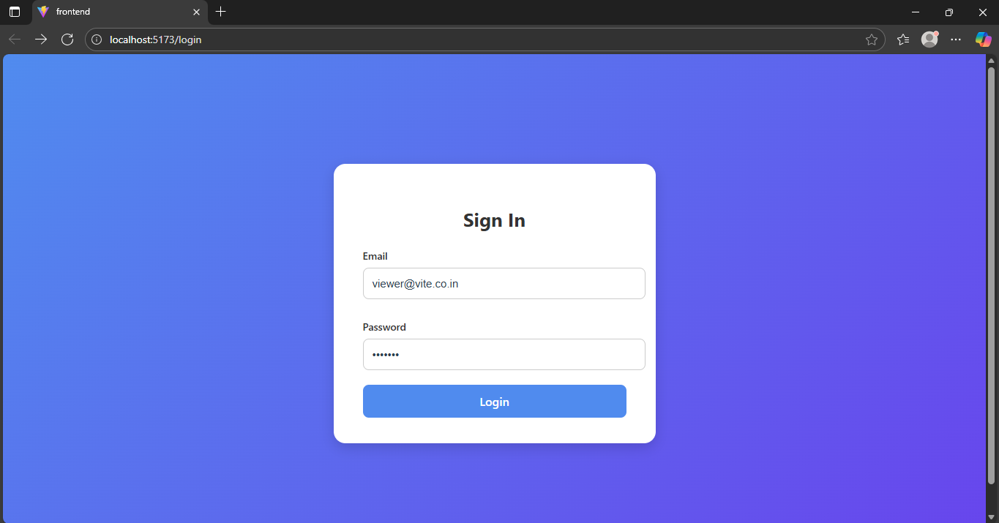
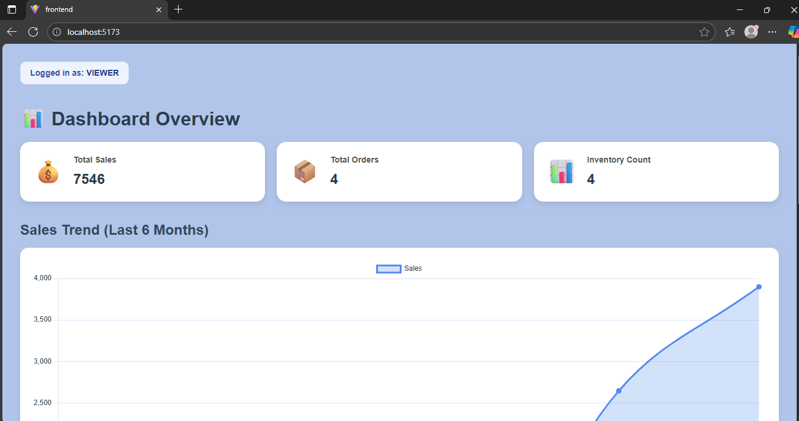
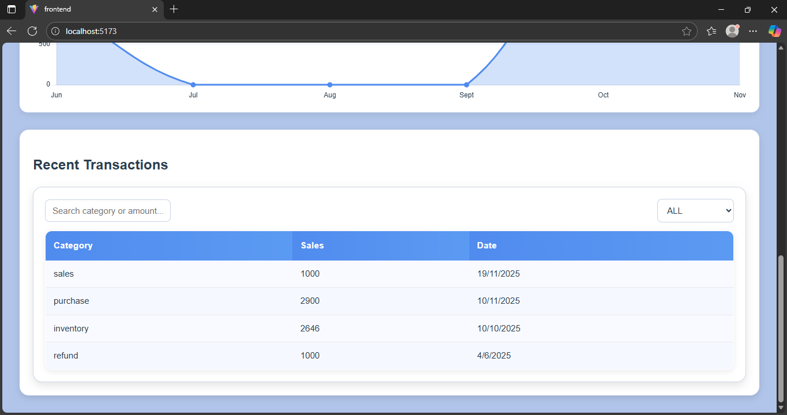
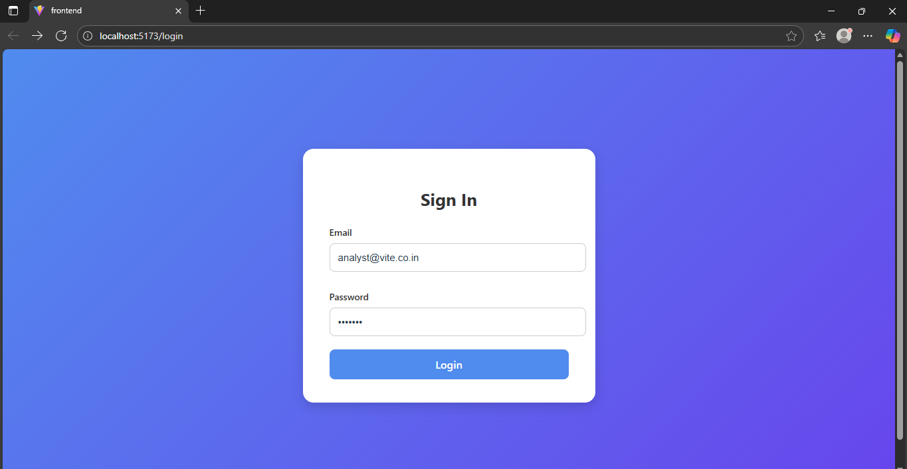
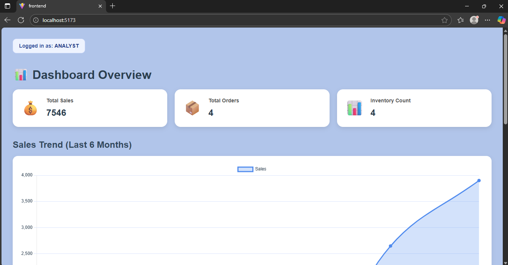
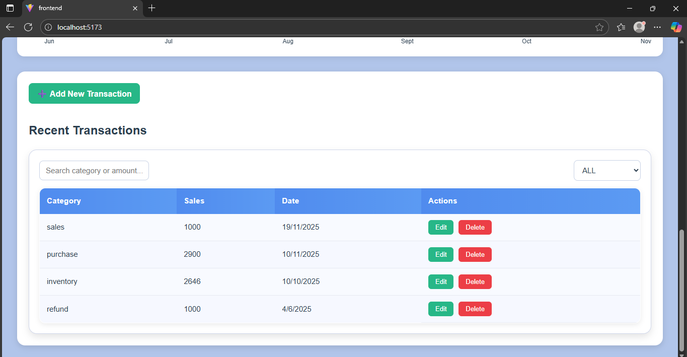
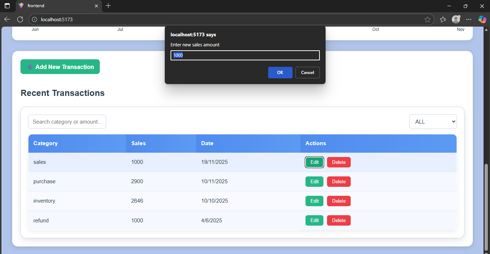

# 🌟 ERP Dashboard — MERN Stack

A complete **ERP-style analytics dashboard** built using **MongoDB, Express, React, and Node.js** featuring:

✔ Authentication (Viewer + Analyst roles)  
✔ Sales chart (last 6 months)  
✔ Filters & Search  
✔ CRUD operations (Analyst only)  
✔ Modern UI with summary cards  
✔ Add / Edit / Delete transactions  
✔ Responsive dashboard layout  

---

## 🚀 Live Demo (Optional)
Add link here if deployed.

---

## 📸 Screenshots

### 🔐 Login Page

### 📊 Dashboard Overview

### 📈 Sales Chart

### 📋 Transactions Table

---

## 📦 Tech Stack

### **Frontend**
- React (Vite)
- Chart.js + react-chartjs-2  
- Axios  
- CSS Modules  

### **Backend**
- Node.js  
- Express.js  
- MongoDB Atlas  
- Mongoose  
- JWT Authentication  
- Bcrypt  

---

## 🔑 User Roles

### Viewer
- Can **view dashboard**
- Can **search, filter, view charts**
- ❌ Cannot add/edit/delete transactions

### Analyst
- Can **add new transactions**
- Can **edit existing data**
- Can **delete records**
- Full access to dashboard

---

## ✨ Features

- 📊 Real-time metrics  
- 📉 Monthly sales trend  
- 📁 Category-based filtering  
- 📝 CRUD operations (role restricted)  
- 🔐 JWT-based authentication  
- 🎨 Full responsive UI  
- 🌙 Smooth chart animations  

---

## 📁 Project Structure

/backend
/models
/routes
/middleware
server.js
/frontend
/src
/components
/pages
/auth
App.jsx

---

## 🛠 Installation

### 1️⃣ Clone the repository

git clone https://github.com/your-username/erp-dashboard.git
cd erp-dashboard

2️⃣ Install dependencies
Backend:
cd backend
npm install

Frontend:
cd ../frontend
npm install

⚙️ Environment Variables
Create /backend/.env:

MONGO_URI=your_mongodb_atlas_uri
JWT_SECRET=your_secret
TOKEN_EXPIRY=8h

▶️ Run Project
Backend:
cd backend
npm run dev

Frontend:
cd frontend
npm run dev

🔥 Seed Sample Data (Optional)
node seed.js

Creates:
viewer@vite.co.in (pass123)
analyst@vite.co.in (pass123)

🧑‍💻 Author
Ayush Aggarwal
